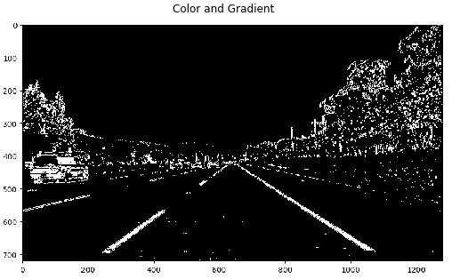

# Advanced Lane Finding Project
- Prabath Peiris
- peiris.prabath@gmail.com
- Self-Driving Car NanoDegree
- Term 1
- Udacity

# Camera Calibration

## Distortion

When a camera takes a 3D objects from the real world and transforms into 2D images, there is some distortion get introduce to the image. This is a form of optical aberration. Distortion can be irregular and can follow many patterns. The most commonly encountered distortions are mostly radially symmetric due to the symmetry of photographic lenses. These Radial distortions can use classified into three main categories.

- **Barrel Distortion** - image magnification decreases with distance from the optical axis.

- **Pincushion distortion** - Image magnification increases with the distance from the optical axis

- **Mustache distortion** - Stars our as a barrel distortion close to the image center and gradually turns in to pincushion distortion.

**Tangential distortion** is another type of distortion that occurs in cameras. This type of distortion happens when the camera's lens is not aligned perfectly parallel to the imaging plane. This makes an image lool tilted.

## Camera Calibration

The camera distortion, particularly radial distortion can be corrected using a correction formula. The formula basically maps pixels locations from distorted image to undistorted image. The formula to correct the radial distortion as follows,

*x_ideal* - is the ideal image we are using to correct the locations of the image we are taking using the camera.

give the above formula; we need to compute three coefficients **k_1, k_2, k_3**. These coefficients has been computed using CV2 package. These coefficients are computed using OpenCV function `cv2.calibrateCamera` and we refer to these coefficients as *camera matrix*. Once I compute this camera matrix, I save to a file (as a pickle file) for later use. This allow me to reuse the camera matrix without compute every single time when I execute the program. Once this process is completed, we can apply the camera matrix to correct the aberration of each image taken by this camera. The following sample show the original image and the distortion corrected image.

# Pipeline (test images)

## Example of distortion-corrected image from test image set

Before we perform any type of image analysis on test images, we need to correct the camera distortion by applying to camera matrix to correct it. Following sample show before and after correcting the camera distortion on a test image. OpenCV `cv2.undistort` method used to perform the correction. The code for this is located at the [`calibrateCam.py`](calibrateCam.py) file.

## How the threshold image has been created (color, gradients, binary thresholds)

Next step in the pipeline is to apply series of steps to generate threshold images.

### Edge detection

#### Compute Thresholds

##### Canny edge detection
I have used the Sobel operator to detect edges in the images. Sobel operator is at the heart of the Canny edge detection algorithm. Sobel operator can be apply x (Sobel_x) and y (Sobel_y) directions. Size of the sobel operator is call the kernel size. I have used the kernel size of 3 (imply 3x3 operator). These operators compute the gradient of the image in x and y directions respectively. The Sobel operators are shown below.

The following image show the applying sobel operator in x direction. After playing around with x and y directional gradients, I found out that the x direction works much better. The code for this computation is located at the `abs_sobel_thresh(...)` method in [thresholding.py](thresholding.py) file.

##### Magnitude of the Gradient

This apply a threshold to the overall magnitude of the gradient in both x and y directions. The magnitude of the gradient is calculated as the square root of the squares of the individual x and y gradients. Following image show the magnitude of the gradient apply for one of the test images. The code for this computation is located at the `mag_thresh(...)` method in [thresholding.py](thresholding.py) file.

##### Direction of the Gradient

In the case of lane line detection, we are interested particular orientation. The direction of the gradient explore the orientation of the gradient. The direction of the gradient is simply the inverse tangent (arctangent, compute using `np.arctan2`) of the y gradient divided by the x. This produce noisier images but the we should be able to find the features we are looking for. The following image show the directional gradient applied to one of the test images. The code for this computation is located at the `dir_threshold(...)` method in [thresholding.py](thresholding.py) file.

##### Color Thresholding

A color space is a specific organization of colors; color spaces provide a way to categorize colors and represent them in digital images. There are couple of color spaces are common in image analysis: RGB, HSV, and HLS. OpenCV provide functionalities to convert from one color space to another. After playing around with color channels I have found the S channel of the HLS color space provide grader details. The following image show the S channel threshold applied to one of the test images. The code for this computation is located at the `hls_select(...)` method in [thresholding.py](thresholding.py) file.

#### Combining Thresholds

Once I have play around with all the above thresholding method, I have combine all the results in to single image. The code for this computation is located at the `applyThreshold(...)` method in [thresholding.py](thresholding.py) file. Following image is one of the test images used all of the above thresholding combination.

## Perspective transform

Once we have the threshold image, we have an image with clear lane lines are identified; however, this image has many other lines that had been detected. Now we have to focus on only the region we are interested in. For this projects its the lane lines on the road. Using perspective transform we can focus on region of interest. The following image show the application of perspective transform in one of the test images.

As a start point for perspective transform, I pick 4 points in the source image (left image above) and mark the region of interest (in this project it's the lanes lines). We refer to these points as source points. Once we identify the source points, we also need to recognize another 4 points that transform source points which we call destination points. Once we determine these source and destination points, I have employed the `cv2.getPerspectiveTransform(...)` method to compute the transformation matrix. Once we have this transformation matrix, we can apply the OpenCV method `cv2.warpPerspective(...)` to transform an image and get the image that focuses area of interest. We do not compute this transformation matrix for every single image since the images we are using for this project is coming from a single camera and the dimensions of the images are the same. We will be using the transformed image to perform lane detections. Once we have detected the lines, we need to map that lane lines back into the original image. For this transformation is called the inverse transform and the matrix that use for this transformation is called the inverse transformation matrix. We can compute this matrix by using the same OpenCV method `cv2.getPerspectiveTransform(...)` but now the source points become the destination points, and destination points become the source points. Code for this part of the project can be found in `perspectiveTransform(...)` method in [perspective_transform.py](perspective_transform.py) file.

## Identify lane pixels and fit a polynomial

Once we have the transformed image, we need to locate the lanes line pixels. We start with the binary transformed image from the previous step and generate a histogram to identify the pixels that belongs to lane lines.

Histogram shows the hot pixels (sum of the pixel values along each column). The right and left peaks show where are the left and right lane starting points respectively. I have used the sliding window to recognize the lane lines. Sliding windows track the left and right lanes and move up when it reach the minimum number of hot pixels that defined in the program as a parameter. Using these pixel values, I fit a second order polynomial to get a approximated function that maps the lanes lines. The following image show the fitted polynomial to lane line pixels.

## How did calculate the radius of the curvature.

## Show final image with lane lines are identified

# Pipeline video
link to final video

# Discussion
describe problems, issues, that I faces.
where will my pipeline likley to fail.
what can I do to make it robust
